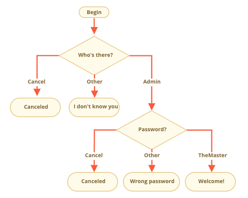

###### Question 1:
Which value does x have after
execution of the following code?
 
```js
let x = "Pooh";
let y = "Tigger";
let z = y;
y = x;
x = z;
```
x = Tigger
---
 
###### Question 2:
Write a function secondIndexOf, taking two strings
and determining the second occurrence of the second
string in the first string. If the search string
does not occur twice, -1 should be returned.
 
Example: secondIndexOf('White Rabbit', 'it') should return 10.
Use indexOf twice.
 
```js
function secondIndexOf(s1, s2) {
    let first = s1.indexOf(s2);
    let second = s1.indexOf(s2, first + 1);
    return second;
}
```
 
---
###### Question 3:
Write a function equals that checks two values
for strict equality. If the two values are equal,
the string 'EQUAL' should be returned. If they
are unequal, you should get 'UNEQUAL'.
 
Example: equals(1, 1) should return 'EQUAL' and equals(1, 2)
should return 'UNEQUAL'.
 
Initialize a variable with 'UNEQUAL'.
Use 'if' to set the variable to 'EQUAL' if necessary.
Return the variable.

```js
function equals(a, b) {
    let check = 'UNEQUAL';
    if(a === b) {
    check = 'EQUAL';
    }
    return check;
}
```

---
###### Question 4:
Write an if/else statement with the following condition:
 
If the variable age is greater than 18, output "Old enough",
otherwise output "Too young".

```js
function checkOld(age) {
    if(age > 18) {
        console.log("Old enough");
    } else {
        console.log("Too young")
    }
}
```

---
###### Question 5:
Write a function repdigit that determines whether a two-digit
decimal is a repdigit or not. If the decimal is a repdigit,
'Repdigit!' should be returned, otherwise 'No Repdigit!'.
 
Example: repdigit(22) should return 'Repdigit!' and repdigit(23)
should return 'No Repdigit!'.
 
Calculate the ones digit of n with modulo 10.
Calculate the tens digit of n by dividing by 10 and rounding down.
Compare ones and tens digits.

```js
function repdigit(n) {
    let big = Math.trunc(n/10);
    let small = n % 10;
    if(big === small) {
        return 'Rapdigit!';
    } else {
        return 'No Rapdigit!'
    }
}
```
 
---
###### Question 6:
Write a function unequal that checks 3 values for strict inequality.
The function should return true if all three parameters are strict
unequal. Otherwise false.
 
Example: unequal(1, 2, 3) should return true and unequal(1, 1, 2)
should return false.
 
```js
function unequal(a, b, c) {
    return a !== b && b !==c && c!==a
}
```

---
 
###### Question 7:
Which of these alerts are going to execute?
 
What will the results of the expressions be inside if(...)?
 
???
```js
if (-1 || 0) alert( 'first' ); true
if (-1 && 0) alert( 'second' ); falth
if (null || -1 && 1) alert( 'third' ); true
```
 
---
 
###### Question 8:
Write the code which asks for a login with prompt.
 
If the visitor enters "Admin", then prompt for a password,
if the input is an empty line – show “Canceled”, if it’s
another string – then show “I don’t know you”.
 
The password is checked as follows:
 
If it equals “TheMaster”, then show “Welcome!”,
Another string – show “Wrong password”,
For an empty string or cancelled input, show “Canceled”
 
Refer to the schema below:



```js
function nameCheck(name) {
    if (name == 'Admin') {
        prompt('Password?');
    } else if (name == '') {
        prompt('canceled');
    } else {
        prompt(`I don't know you`);
    }
}

function passwordCheck(pass) {
    if (pass == 'TheMaster') {
        prompt('Welcome!');
    } else if (pass == '') {
        prompt('canceled');
    } else {
        prompt('Wrong password');
    }
}

```